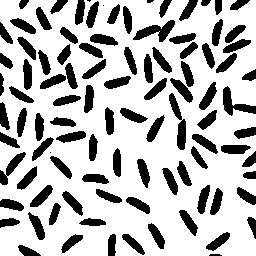
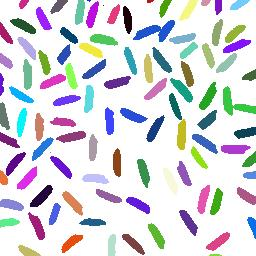
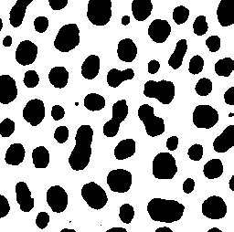
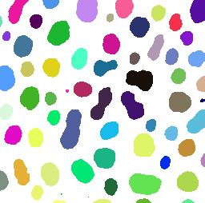

# CCA
Implementation of classic Connected Component Analysis based off row-by-row labeling algorithm in Shapiro and Stockman's book Computer Vision with a psuedo union-find structure.
ImageJ V2 was used for image manipulation.

Project for csc484 - Image Analysis at SUNY Oswego

Before:

After:

Before:

After:

Citation:

Shapiro, Linda G., and George C. Stockman. *Computer vision*. Upper Saddle River, NJ: Prentice Hall, 2001. Print.

Rueden, C. T.; Schindelin, J. & Hiner, M. C. et al. (2017), "ImageJ2: ImageJ for the next generation of scientific image data", BMC Bioinformatics 18:529, PMID 29187165, doi:10.1186/s12859-017-1934-z 
